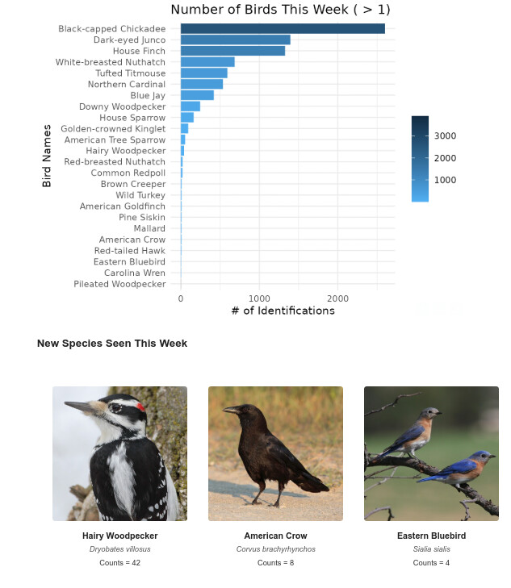

# Bird Email Report
[](https://opensource.org/licenses/MIT)

This project generates a weekly email report of bird sightings.




## Dependencies

*   **R:**
    *   `httr`
    *   `jsonlite`
    *   `ggplot2`
    *   `dplyr`
    *   `lubridate`
    Install these packages using `install.packages(c("httr", "jsonlite", "ggplot2", "dplyr", "lubridate"))` in R.
*   **PHP (these should be automatically installed with PHP, but check):**
    *   `mbstring`
    *   `gd` (for image handling)
    *   outside of PHP, you will also need to install composer (check instructions for your OS), along with the composer package: vlucas/phpdotenv

## Setup

1.  Clone this repository: `git clone ...`
2.  Install the R and PHP dependencies.
3.  **API Key Setup:**
    *   Create a file named `.Renviron` in the root directory of the repository.
    *   Add the following line to `.Renviron`, replacing `YOUR_ACTUAL_API_KEY` with your BirdWeather API token:

        ```
        BIRD_API="YOUR_ACTUAL_API_KEY"
        ```

    *   **Important:** Ensure that `.Renviron` is added to your `.gitignore` file to prevent accidentally committing your API key.  I have already added this to .gitignore in the standard .gitignore file.
4.  **Cron Job Setup:**
    *   This project relies on a cron job to run the scripts automatically each week.
    *   **Option 1: Using the provided `cron/weekly_report.cron` file:**
        *   Open the `cron/weekly_report.cron` file and **carefully update the paths** to point to the correct location of your`php`, and your PHP script on your system.  *These paths are likely different on your system!*
        *   Then, run `crontab cron/weekly_report.cron` to install the cron job.
    *   **Option 2: Manual Cron Job Setup:**
        *   Run `crontab -e` to edit your crontab file.
        *   Add a line similar to the following, **modifying the paths accordingly**:

            ```
            0 6 * * Sun  /usr/bin/php /path/to/Home/php/email_generator.php
            ```

            This will run the script every Sunday at 6:00 AM. The example will run the script at noon every Friday.
